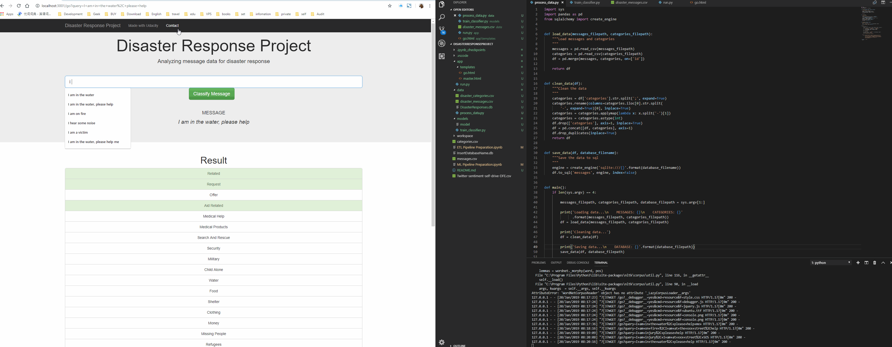

# Disaster Response Pipeline Project

### Installation:
If you are using Python3 from https://www.python.org, then you can use the standard pip installer to install libraries.

pip install pandas 
pip install seaborn 
pip install numpy 
pip install matplotlib 
pip install pickle
pip install sklearn
pip install nltk
pip install sqlalchemy

### Project Motivation:
This project will include a web app where an emergency worker can input a new message and get classification results in several categories. The web app will also display visualizations of the data. 

### Instructions:
1. Run the following commands in the project's root directory to set up your database and model.

    - To run ETL pipeline that cleans data and stores in database
        `python data/process_data.py data/disaster_messages.csv data/disaster_categories.csv data/DisasterResponse.db`
    - To run ML pipeline that trains classifier and saves
        `python models/train_classifier.py data/DisasterResponse.db models/model`

2. Run the following command in the app's directory to run your web app.
    `python run.py`

3. Go to http://localhost:3001/